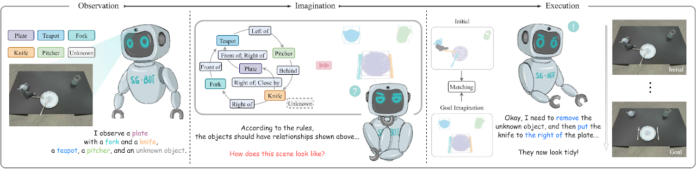

# SG-Bot
This is a minimal implementation of the paper **SG-Bot:
Object Rearrangement via Coarse-to-Fine Robotic Imagination on Scene Graphs (ICRA 2024), [arxiv](https://arxiv.org/abs/2309.12188)**.
<div style="text-align: center;">
  <figure style="display: inline-block; margin: 10px; width: 98%">
    
  </figure>
</div>

## Setup

```javascript
conda env create -f environment.yml
cd extension
python setup.py install
```
Please also install [Pytorch](https://pytorch.org/). We test it with Pytorch 1.12.1 with CUDA 11.6.
## Dataset
Please refer to [this page](https://sites.google.com/view/sg-bot/dataset) for downloading the data used in the paper and more information.

## Module Instruction
### Shape autoencoders
We set up two shape autoencoders called `AtlasNet` and `AtlastNet2`. `AtlasNet` is trained with full shapes under canonical coordinates, 
while `AtlasNet2` is trained under the camera frame, which provides shape priors to the goal scene graph to guide the imagination. We also provide trained models downloaded here: [trained AtlasNet](https://www.campar.in.tum.de/public_datasets/2023_sgbot_zhai/AE_AtlasNet_add_cup_20230815T1718.zip) and [trained AtlasNet2](https://www.campar.in.tum.de/public_datasets/2023_sgbot_zhai/AE_AtlasNet2_20230408T2110.zip).
* **For generating shapes**

    * **Train `AtlasNet`**. Need to adjust `--batchSize`，`--nepoch` to make the training optimal.
    ```
    cd AtlasNet
    python training/train_AE_AtlasNet.py
    ```
    * **Inference point clouds [optional]:** run `AtlasNet/inference/run_AE_AtlasNet.py`. The results would store generated points under `AtlasNet/log/atlasnet_separate_cultery/network`.

    * **Obtain point feature for training Graph-to-3D:** run `AtlasNet/inference/create_features_gt.py`, and the features are stored in`objs_features_gt_atlasnet_separate_cultery.json` . The keys in the json file are the name of the objects, e.g., "cup_1", and the values are the latent features (128 dimensions).
* **For producing shape priors**
    * **Store partial points in the initial scenes under the camera frame:** This aims to train `AtlasNet2`. The files can be downloaded from here: [partial_pcs](https://www.campar.in.tum.de/public_datasets/2023_sgbot_zhai/partial_pc_data.zip). 
You can also modify the file path and run `AtlasNet2/auxiliary/generate_partial_pc_for_object.py`. The final output are stored as pickle files under `AtlasNet2/partial_pc_data`.
    * **Split the trainval set:** Function `generate_train_sample` in `AtlasNet2/auxiliary/generate_partial_pc_for_object.py` splits `AtlasNet2/partial_pc_data` into train (90%) and test (10%). The file names are stored as `AtlasNet2/partial_pc_data_splits.json`
    * **Train `AtlasNet2`:** The procedure is the same as `AtlasNet`.


### Scene Generator
We built the scene generator based on [Graph-to-3D](https://he-dhamo.github.io/Graphto3D/), a GCN-VAE architecture. Different from the original Graph-to-3D, we leverage a shape-aware scene graph to make the generated shapes aligned with the observed shapes in the initial scene.
We provide the trained model available here: [trained graph_to_3d](https://www.campar.in.tum.de/public_datasets/2023_sgbot_zhai/graphto3d_2_world_add_cup.zip).

If you want to retrain the network, `--batchSize`, `--nepoch`, `--exp` needs to be set with proper numbers.

```
cd graphto3d
python scripts/train_vaegan.py
```
More details can be found in the [original repository](https://github.com/he-dhamo/graphto3d).
## Simulation
There are two modes--`robot` and `oracle`. The `robot` mode support a robot arm manipulating the objects according to the imagination. This mode needs a grasping pose prediction network, which we use [Contact-GraspNet](https://github.com/NVlabs/contact_graspnet). This needs tensorflow downloaded. 
```javascript
pip install tensorflow-estimator==2.7.0 tensorflow-gpu==2.7.0
```
The checkpoints can be downloaded from the original repository or [here](https://www.campar.in.tum.de/public_datasets/2023_sgbot_zhai/graspnet_checkpoints.zip). After download the checkpoints, move them to `./contact_graspnet`.

The `oracle` mode does not need an agent, but just directly put objects in relative poses. To make the script work, one can modify the variable `mode` inside, and then run:
```
python sgbot_pybullet.py
```
The results in the paper are under the `oracle` mode. We directly use the pre-defined scene graph as the goal.
## Real-world Trial [TODO]
We provide a recorded rosbag to demonstrate the performance. To conduct this trial, MaskRCNN checkpoint needs to be downloaded from [here]().
Additional requirements need to installed.