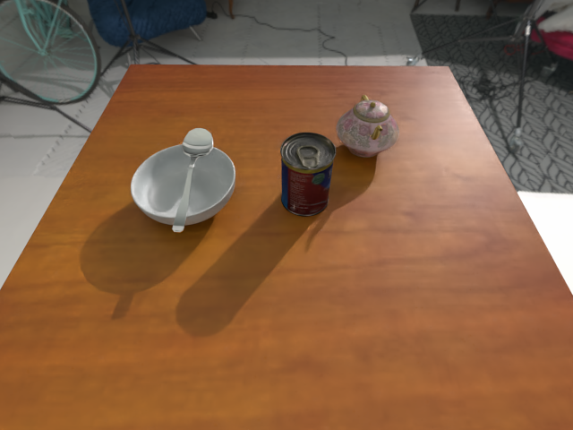

# SG-Bot Dataset
### Download link: [sgbot_dataset.zip](https://www.campar.in.tum.de/public_datasets/2023_sgbot_zhai/sgbot_dataset.zip) (~55G).

The dataset serves mainly for [object rearrangement research](https://arxiv.org/abs/2011.01975), but can also be used to do other areas, e.g., object segmentation, depth estimation, robotic grasping, scene graph, and language-guided tasks. It is collected by placing availble meshes from [Google Scanned Objects](https://research.google/blog/scanned-objects-by-google-research-a-dataset-of-3d-scanned-common-household-items/) and [HouseCat6D](https://sites.google.com/view/housecat6d) on tabletop scenarios physically checked by [Pybullet](https://pybullet.org/wordpress/) and rendered by [NViSII](https://github.com/owl-project/NVISII).

<div style="text-align: center;">
  <figure style="display: inline-block; margin: 10px; width: 20%">
    
    <figcaption><em>A. Initial scene 1</em></figcaption>
  </figure>
  <figure style="display: inline-block; margin: 10px; width: 20%">
    
    <figcaption><em>B. Goal scene 1</em></figcaption>
  </figure>
  <figure style="display: inline-block; margin: 10px; width: 45%">
    
    <figcaption><em>C. Goal scene graph 1</em></figcaption>
  </figure>
</div>

<div style="text-align: center;">
  <figure style="display: inline-block; margin: 10px; width: 20%">
    
    <figcaption><em>A. Initial scene 2</em></figcaption>
  </figure>
  <figure style="display: inline-block; margin: 10px; width: 20%">
    
    <figcaption><em>B. Goal scene 2</em></figcaption>
  </figure>
  <figure style="display: inline-block; margin: 10px; width: 45%">
    
    <figcaption><em>C. Goal scene graph 2</em></figcaption>
  </figure>
</div>

## Data structure
```
sgbot_dataset.zip
|--📁 raw
    |--📁 table_id
        |--📄 scene_name.obj # scene mesh
        |--📄 scene_name{none/_mid/_goal}_view-{1/2}.json # scene rendering params
        |--📄 scene_name{none/_mid/_goal}_scene_graph.json # scene graph labels
        |--🖼 scene_name{none/_mid/_goal}_scene_graph.png # scene graph visualization
        |--🖼 scene_name{none/_mid/_goal}_view-{1/2}.png # rendered RGB image
        |--🖼 scene_name{none/_mid/_goal}_view-{1/2}_camp_depth.png # rendered depth image
        |--📄 scene_name{none/_mid/_goal}_view-{1/2}_depth.pkl # raw depth data
        |--🖼 scene_name{none/_mid/_goal}_view-{1/2}_seg.exr # object masks
|--📁 models
    |--📁 bottle               # original object meshes
    ...
    |--📁 bottle_simplified    # watertight and simplified meshes
    ...
|--📁 collision                # decomposed meshes for pybullet simulation 
    |--📁 bottle  
    ...   
|--📄 relationships_{train/validation}.json
    Scene graph labels for all scenes: list of all triplets consisting of semantic classes (nodes) and semantic relationships (edges).
|--📄 obj_boxes_{train/validation}.json
    Bounding boxes of each object in all scenes.
|--📄 classes.txt
    List of the semantic classes.
|--📄 relationships.txt
    List of all relationship types.
|--📄 train_scenes.txt
    training split.
|--📄 description.json
    scene description in sentences. (for LLM usage)
```
## Details
### Rules for naming
We define that the collected scenes with a bowl inside may contain tablespoon. The scenes containing a cup may contain a teaspoon as well. The scenes containing a plate may contain a fork and a knife.
`table_id` is the name of the current table used to collect scenes.
`scene_name` is the name of the current scene.
It has three types based on a common PREFIX--"`table_id`_`scene_id`_`num_of_objects`_scene-`scene_type`":

1. **Initial scene** (objects in random positions and rotations)--just PREFIX. 
2. **Middle scene** (objects in random positions and canonical rotations)--PREFIX+`_mid`.
3. **Goal scene** (objects in goal positions and canonical rotations)--PREFIX+`_type-{cutlery_rel}_goal`.

`num_of_objects`: The number of objects in this scene.

`scene_type`: It may contain one, two or all categories from {bowl, cup, plate}. `X` means there is no existence of this category. For example, A scene that only contains a bowl will be named as  `X-bowl-X`, while a scene containing a bowl and a plate is named as `bowl-plate-X`.

`cutlery_rel`: The relation between the cutlery and the object in the scene. For example, a scene containing a bowl (without plate and cup) with a table spoon inside is named as `X-in-X`. Together with `scene_type`, the completed name is  `scene-X-bowl-X_type-X-in-X`. 

### Scene parameters
Each scene contains `scene_name{none/_mid/_goal}_view-{1/2}.json`, describing the rendering settings and object status. 
```
{
    camera_data: {                 # camera location and intrinsics
        "width": 640,
        "height": 480,
        "segmentation_id": 0,
        "camera_look_at": {"at":...,"eye":...,"up":...},
        "camera_view_matrix":...,
        "camera_local_to_world_matrix":...,
        "location_world": ...,
        "quaternion_world_xyzw": ...,
        "intrinsics": ...
    } 
    objects: {
        "class": "teapot",         # class name
        "name": "teapot_1",        # object name {class}_{id}
        "global_id": 39,           # global id in the dataset
        "class_id": 11,
        "segmentation_id": 4,      # instance id
        "color": "#80a261",        # color hex id
        "scale": 0.13,             # the scale applied to the original mesh
        local_to_world_matrix: ... # the location matrix under the world frame
        8points: ...               # axis-aligned bounding box corners
        param6: ...                # size and location, [l, w, h, cx, cy, cz]
        location: ...              # postion under the camera_frame
        quaternion_xyzw: ...       # rotation using quaternion
        visibility_image: ...      # 1 means visible, 0 means invisible
        bounding_box: ...          # 2D bbox
    }
}
```

### Scene graph labels
`relationships_[train/validation].json` contain labels for all scenes in the dataset.  The structure is similar to [3DSSG](https://3dssg.github.io/) and [SG-FRONT](https://sites.google.com/view/commonscenes/dataset), except that the ids are globally consistent for the whole dataset.
```
"scenes":
{
  "scene_id": "faa5d5ba2a002922511e5b9dc733c75c_0124_5_scene-X-bowl-cup_mid", # scene name
  "relationships": [
    [
      18,           # obj_A global_id
      113,          # obj_B global_id
      6,            # relationship_id
      "standing on" # relationship
    ],
    ...
  ],
  "objects": {
     "76": "box"     # global_id: object name
     ...
  }
  ...
}
```
### Bounding box labels
`obj_boxes_{train/validation}.json` concurs as above. `none` means 
```
{
  "faa5d5ba2a002922511e5b9dc733c75c_0124_5_scene-X-bowl-cup_mid": {
    "76": {                                                         # object global id
      "param6": [0.07584431767463684,...],                          # bbox params (l,w,h,x,y,z)
      "8points": [                                                  # corner points af each bbox
        [0.300864040851593,0.06781280040740967,0.24956436455249786], 
        ...
      ]
    },
    ...
  }
  ...
}
```

## Acknowledgement
The dataset is under MIT license. For any queries, feel free to drop an email to `guangyao.zhai@tum.de`.